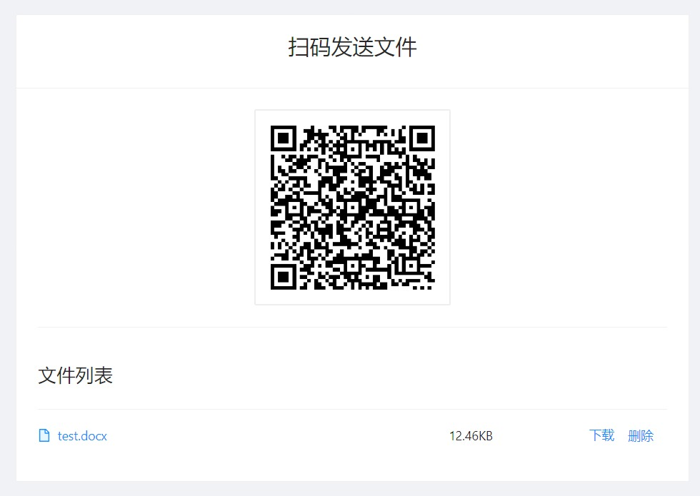
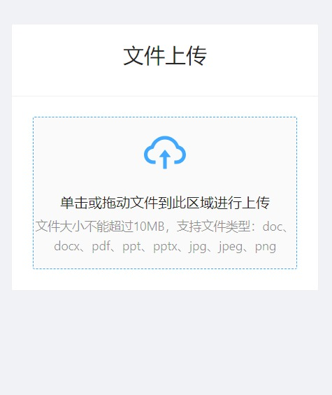

## 扫码发送文件-前端

接口端：<https://github.com/zhanguangcheng/scan-send-file-api>

## 工作原理

1. 用户在pc打开打印页面，页面上有一个二维码
2. 二维码中是一个链接，包含随机唯一编号(加签防篡改)
3. 手机扫码后打开文件上传页面，用户上传文件后保存
4. 打印页面根据唯一编号轮询文件上传状态，监测到有文件后显示出来
5. 用户点击文件进行下载

## 截图

